# Admin Command Menu Design

## Overview

This design outlines the implementation of an enhanced admin command menu system for CupBot that provides button-based navigation for administrative operations, including system power management, user administration, and existing services like file management and screenshots. The menu system eliminates the need for manual command typing and provides an intuitive interface for administrators.

## Technology Stack & Dependencies

**Core Technologies:**
- Go 1.23+ (per project requirements)
- Telegram Bot API v5 (`github.com/go-telegram-bot-api/telegram-bot-api/v5`)
- Windows API integration for power management
- Existing CupBot modular architecture

**Key Dependencies:**
- `internal/auth` - Role-based access control
- `internal/bot` - Telegram message handling and keyboards
- `internal/system` - System information and power operations
- `internal/filemanager` - File system operations
- `internal/screenshot` - Screen capture functionality

## Architecture

### Component Architecture


### Menu Hierarchy Structure


## Core Features

### 1. Enhanced Admin Menu System

#### Main Admin Interface
The admin menu provides categorized access to all administrative functions through inline keyboard buttons.

**Menu Categories:**
- 🔌 Power Management
- 👥 User Management  
- 📁 File Manager
- 📸 Screenshot Service
- 💻 System Monitoring
- 🔧 Admin Tools

#### Interactive Button Navigation
All admin operations are accessible through button interactions, eliminating command-line input requirements.

### 2. Power Management Module

#### System Power Commands
- **Shutdown Computer**: Immediate and scheduled shutdown options
- **Restart Computer**: Immediate and scheduled restart options
- **Force Shutdown**: Emergency system shutdown
- **Force Restart**: Emergency system restart

#### Implementation Structure

```mermaid
sequenceDiagram
    participant Admin as Admin User
    participant Bot as Bot Interface
    participant Auth as Auth Middleware
    participant Power as Power Service
    participant WinAPI as Windows API

    Admin->>Bot: Click "🔌 Power Menu"
    Bot->>Auth: Validate Admin Rights
    Auth-->>Bot: Authorization Success
    Bot-->>Admin: Show Power Options
    
    Admin->>Bot: Click "Shutdown"
    Bot-->>Admin: Show Confirmation
    Admin->>Bot: Confirm Shutdown
    Bot->>Power: ExecuteShutdown()
    Power->>WinAPI: InitiateSystemShutdown()
    WinAPI-->>Power: Success
    Power-->>Bot: Shutdown Initiated
    Bot-->>Admin: "System shutdown initiated"
```


#### Power Management Interface Design
- Confirmation dialogs for destructive operations
- Scheduled shutdown/restart options (1min, 5min, 10min, 30min)
- Emergency force options with warnings
- Cancel operation functionality

### 3. Enhanced User Management

#### Button-Based User Operations
All user management operations converted to interactive button interfaces:

**User Management Menu:**
- 👥 List All Users
- ➕ Add Administrator
- ➖ Remove Administrator  
- 🚫 Ban User
- ✅ Unban User
- 🗑️ Delete User
- 📊 User Statistics

#### User Selection Interface


### 4. File Manager Integration

#### Enhanced File Navigation
- Directory browsing with breadcrumb navigation
- File operations through inline buttons
- Drive selection interface
- File upload/download management

#### File Manager Interface


### 5. Screenshot Service Enhancement

#### Service Status Handling
The screenshot service must handle Windows Service context limitations:

**Service Context Detection:**
- Check if running as Windows Service
- Disable screenshot functionality when running as service
- Provide clear error messages to administrators
- Alternative suggestion to use interactive mode

#### Screenshot Interface Flow


## API Endpoints Reference

### Admin Menu Callback Handlers

#### Power Management Callbacks
| Callback Data | Description | Admin Required |
|---------------|-------------|----------------|
| `power_menu` | Show power management options | Yes |
| `shutdown_now` | Immediate shutdown | Yes |
| `shutdown_1min` | Shutdown in 1 minute | Yes |
| `shutdown_5min` | Shutdown in 5 minutes | Yes |
| `restart_now` | Immediate restart | Yes |
| `restart_1min` | Restart in 1 minute | Yes |
| `force_shutdown` | Force immediate shutdown | Yes |
| `cancel_shutdown` | Cancel scheduled shutdown | Yes |

#### User Management Callbacks  
| Callback Data | Description | Admin Required |
|---------------|-------------|----------------|
| `user_menu` | Show user management menu | Yes |
| `list_users` | Display all users | Yes |
| `add_admin_menu` | Show add admin interface | Yes |
| `remove_admin_menu` | Show remove admin interface | Yes |
| `ban_user_menu` | Show ban user interface | Yes |
| `unban_user_menu` | Show unban user interface | Yes |
| `delete_user_menu` | Show delete user interface | Yes |

#### Enhanced Service Callbacks
| Callback Data | Description | Admin Required |
|---------------|-------------|----------------|
| `admin_main_menu` | Return to admin main menu | Yes |
| `file_manager_admin` | Enhanced file manager for admins | Yes |
| `screenshot_admin` | Admin screenshot interface | Yes |
| `system_tools` | Advanced system tools | Yes |

### Authentication Requirements

All admin menu operations require:
1. User authentication via Telegram ID
2. Admin role verification
3. Active user status check
4. Command logging for audit trail

## Data Models & Database Integration

### Command Logging Enhancement
```sql
-- Enhanced command history for admin operations
CREATE TABLE admin_operations (
    id INTEGER PRIMARY KEY AUTOINCREMENT,
    user_id INTEGER NOT NULL,
    operation_type TEXT NOT NULL, -- 'power', 'user_mgmt', 'file_mgmt'
    operation_name TEXT NOT NULL, -- 'shutdown', 'add_admin', etc.
    target_user_id INTEGER, -- For user management operations
    parameters TEXT, -- JSON parameters
    success BOOLEAN NOT NULL,
    executed_at DATETIME DEFAULT CURRENT_TIMESTAMP,
    FOREIGN KEY (user_id) REFERENCES users(id)
);
```

### Power Management State
```go
type PowerOperation struct {
    Type        string    `json:"type"`        // "shutdown", "restart"
    ScheduledAt time.Time `json:"scheduled_at"`
    UserID      int64     `json:"user_id"`
    IsForced    bool      `json:"is_forced"`
    Confirmed   bool      `json:"confirmed"`
}
```

## Business Logic Layer

### Power Management Service

#### Service Structure
```go
type PowerService struct {
    config *config.Config
    logger *log.Logger
}

func (p *PowerService) InitiateShutdown(delay time.Duration, force bool) error
func (p *PowerService) InitiateRestart(delay time.Duration, force bool) error  
func (p *PowerService) CancelShutdown() error
func (p *PowerService) GetPowerStatus() (*PowerStatus, error)
```

#### Windows API Integration
```go
// Windows shutdown/restart implementation
func (p *PowerService) executeWindowsShutdown(delay time.Duration, restart, force bool) error {
    var flags uint32 = 0
    
    if restart {
        flags |= 0x00000002 // EWX_REBOOT
    } else {
        flags |= 0x00000001 // EWX_SHUTDOWN
    }
    
    if force {
        flags |= 0x00000004 // EWX_FORCE
    }
    
    return windows.ExitWindowsEx(flags, 0)
}
```

### Menu State Management

#### State Tracking
```go
type MenuState struct {
    UserID      int64
    CurrentMenu string
    SubMenu     string
    Context     map[string]interface{}
    LastUpdate  time.Time
}

type MenuManager struct {
    states map[int64]*MenuState
    mutex  sync.RWMutex
}
```

## Middleware & Interceptors

### Enhanced Authentication Middleware

#### Admin Operation Validation
```go
func (m *Middleware) ValidateAdminOperation(userID int64, operation string) error {
    user, err := m.db.GetUser(userID)
    if err != nil {
        return fmt.Errorf("user not found: %w", err)
    }
    
    if !user.IsAdmin {
        return errors.New("admin privileges required")
    }
    
    if !user.IsActive {
        return errors.New("user account is inactive")
    }
    
    // Log admin operation attempt
    m.LogAdminOperation(userID, operation, time.Now())
    
    return nil
}
```

### Power Management Middleware

#### Safety Checks
```go
func (m *PowerMiddleware) ValidatePowerOperation(userID int64, operation PowerOperation) error {
    // Check if user is admin
    if err := m.auth.ValidateAdminOperation(userID, "power_management"); err != nil {
        return err
    }
    
    // Check for existing scheduled operations
    if existing := m.GetScheduledOperation(); existing != nil {
        return errors.New("power operation already scheduled")
    }
    
    // Validate operation parameters
    if operation.ScheduledAt.Before(time.Now()) {
        return errors.New("invalid schedule time")
    }
    
    return nil
}
```

## Testing Strategy

### Unit Testing Approach

#### Menu Navigation Tests
```go
func TestAdminMenuNavigation(t *testing.T) {
    bot := setupTestBot(t)
    admin := createTestAdmin(t, bot.db)
    
    // Test main admin menu access
    response, success := bot.handleAdminMenuCallback(admin)
    assert.True(t, success)
    assert.Contains(t, response, "Admin Menu")
    
    // Test power menu access
    response, success = bot.handlePowerMenuCallback(admin)
    assert.True(t, success)
    assert.Contains(t, response, "Power Management")
}
```

#### Power Management Tests
```go
func TestPowerOperations(t *testing.T) {
    tests := []struct {
        name      string
        operation string
        delay     time.Duration
        force     bool
        expectErr bool
    }{
        {"immediate shutdown", "shutdown", 0, false, false},
        {"scheduled restart", "restart", 5*time.Minute, false, false},
        {"force shutdown", "shutdown", 0, true, false},
    }
    
    for _, tt := range tests {
        t.Run(tt.name, func(t *testing.T) {
            service := NewPowerService(config)
            err := service.scheduleOperation(tt.operation, tt.delay, tt.force)
            if tt.expectErr {
                assert.Error(t, err)
            } else {
                assert.NoError(t, err)
            }
        })
    }
}
```

#### Screenshot Service Context Tests
```go
func TestScreenshotServiceContext(t *testing.T) {
    // Test service context detection
    service := screenshot.NewService(config)
    
    // Mock service context
    os.Setenv("SERVICE_CONTEXT", "true")
    defer os.Unsetenv("SERVICE_CONTEXT")
    
    _, err := service.TakeScreenshot()
    assert.Error(t, err)
    assert.Contains(t, err.Error(), "service mode")
}
```

### Integration Testing

#### End-to-End Menu Flow Tests
```go
func TestCompleteAdminWorkflow(t *testing.T) {
    bot := setupTestBot(t)
    admin := createTestAdmin(t, bot.db)
    
    // Simulate complete admin workflow
    testCases := []struct {
        callback string
        expected string
    }{
        {"admin_main_menu", "Admin Menu"},
        {"power_menu", "Power Management"},
        {"shutdown_1min", "Shutdown scheduled"},
        {"cancel_shutdown", "Shutdown cancelled"},
    }
    
    for _, tc := range testCases {
        response, success := bot.handleCallbackQuery(
            createTestCallback(tc.callback), admin)
        assert.True(t, success)
        assert.Contains(t, response, tc.expected)
    }
}
```

## Security Considerations

### Access Control
- Multi-layer admin verification for power operations
- Confirmation dialogs for destructive actions
- Operation logging for audit trails
- Rate limiting for power operations

### Power Management Security
- Confirmation requirement for immediate shutdowns
- Delay minimums for scheduled operations
- Force operation restrictions
- Cancel operation availability

### Service Context Security
- Screenshot service disabled in Windows Service mode
- Clear error messaging for context limitations
- Alternative operation suggestions

## Implementation Considerations

### Windows Service Limitations
The screenshot functionality faces inherent limitations when CupBot runs as a Windows Service:
- Services run in Session 0 (non-interactive)
- Desktop capture requires interactive session access
- GDI operations may fail in service context

### Performance Optimization
- Lazy loading of menu interfaces
- Cached keyboard layouts
- Efficient callback data encoding
- Minimal database queries for menu operations

### Error Handling
- Graceful degradation for service limitations
- Clear user feedback for failed operations
- Recovery mechanisms for interrupted operations
- Comprehensive logging for debugging