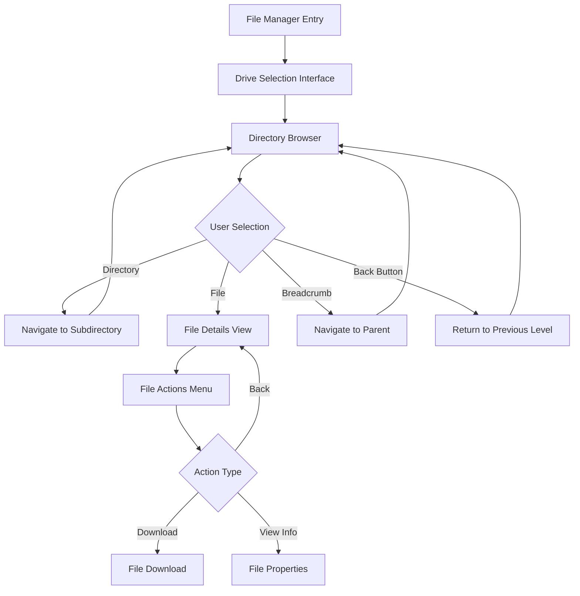
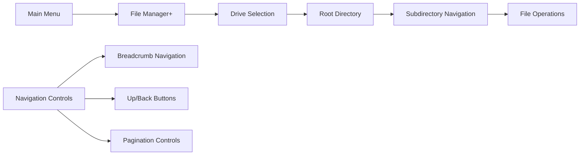

# File Manager Enhancement Design

## Overview

This design enhances the CupBot file manager to provide a Windows Explorer-like experience through Telegram's inline keyboard interface. The current implementation requires manual command input (`/files <drive>`), which will be replaced with an intuitive, button-driven navigation system that mimics Windows Explorer's behavior.

## Current State Analysis

### Existing Implementation
- **Command-based Interface**: Users must type `/files <drive>` to browse directories
- **Basic Directory Listing**: Limited text-based display with 20-item limit
- **Manual Navigation**: No interactive navigation buttons
- **Limited User Experience**: Requires knowledge of specific commands and drive letters

### Current Features Already Implemented
- Drive selection and validation
- Directory browsing with pagination
- File download capabilities
- Breadcrumb navigation
- File/directory information display
- Security controls (drive restrictions, file size limits)

## Enhanced Architecture

### Navigation State Management



### Interface Hierarchy



## Component Design

### 1. Drive Selection Interface

**Visual Layout:**
```
📁 File Manager - Drive Selection

💾 Available Drives:

[💾 C:] [💾 D:]
[💾 E:] [💾 F:]

[🔙 Back to Menu]
```

**Implementation:**
- Auto-detect available drives from configuration
- Display drives in 2-column grid layout
- Show drive status (available/unavailable)
- Include drive space information where possible

### 2. Directory Browser Interface

**Visual Layout:**
```
📁 Current Directory
C:\Users\User\Documents

📍 Path: C: > Users > User > Documents

📊 Contents: 5 folders, 12 files

💡 Click on any item below to navigate:

[📁 Folder1]
[📁 Folder2] 
[📄 Document1.txt]
[📄 Image1.jpg]

[⬆️ Up] [🏠 Drives] [🔄 Refresh]
[🔙 Back to Menu]
```

**Features:**
- **Interactive Breadcrumb**: Each breadcrumb segment is clickable
- **One-Click Navigation**: Single tap to enter directories or view files
- **Visual Indicators**: Different icons for folders, files, system items
- **Quick Actions**: Up, Home, Refresh buttons always visible
- **Status Information**: Folder/file counts, current path display

### 3. File Details Interface

**Visual Layout:**
```
📄 File Details
Document.pdf

📊 Size: 2.5 MB
📅 Modified: 2024-01-15 14:30
🔒 Permissions: Read/Write
📍 Path: C:\Users\User\Documents\Document.pdf

[⬇️ Download] [ℹ️ Properties]
[🔙 Back to Directory] [🏠 Drives]
[🔙 Back to Menu]
```

### 4. Enhanced Navigation Controls

#### Breadcrumb Navigation
- **Clickable Path Segments**: Each part of the path is a button
- **Smart Truncation**: Long paths abbreviated with "..." 
- **Visual Hierarchy**: Current directory highlighted

#### Pagination Controls
```
[◀️ Prev] [Page 2/5] [Next ▶️]
```

#### Quick Navigation
```
[⬆️ Up] [🏠 Drives] [🔄 Refresh] [🔍 Search]
```

## Technical Implementation

### Enhanced Service Methods

#### Directory Navigation Enhancement
```go
type NavigationResponse struct {
    Content        string
    Keyboard       tgbotapi.InlineKeyboardMarkup
    Context        *NavigationContext
    RequiresUpdate bool
}

func (s *Service) GetDirectoryNavigationResponse(path string, page int) (*NavigationResponse, error)
func (s *Service) GetDriveSelectionResponse() (*NavigationResponse, error)
func (s *Service) GetFileDetailsResponse(filePath string) (*NavigationResponse, error)
```

#### Enhanced Callback Handling
```go
type CallbackRoute struct {
    Pattern string
    Handler func(callbackData string, user *database.User) (*NavigationResponse, error)
}

var fileManagerRoutes = []CallbackRoute{
    {"fm_drives", handleDriveSelection},
    {"fm_drive_*", handleDriveNavigation},
    {"fm_dir_*", handleDirectoryNavigation},
    {"fm_file_*", handleFileSelection},
    {"fm_download_*", handleFileDownload},
    {"fm_breadcrumb_*", handleBreadcrumbNavigation},
    {"fm_page_*", handlePagination},
}
```

### State Management

#### Navigation Context Enhancement
```go
type NavigationContext struct {
    CurrentPath     string
    ParentPath      string
    Breadcrumbs     []BreadcrumbItem
    CanNavigateUp   bool
    CurrentPage     int
    TotalPages      int
    ViewHistory     []string  // For back button functionality
    LastAction      string    // Track user's last action
}
```

#### Session State
```go
type UserFileManagerSession struct {
    UserID          int64
    CurrentPath     string
    NavigationStack []string
    LastActivity    time.Time
    Preferences     *UserPreferences
}

type UserPreferences struct {
    PageSize        int
    SortBy          string // name, size, date
    SortOrder       string // asc, desc
    ShowHiddenFiles bool
    ViewMode        string // list, details
}
```

### Callback Data Optimization

#### Encoded Navigation
```go
// Callback data structure: fm_action_base64encodedpath_page
// Examples:
// fm_dir_QzpcVXNlcnM=        (navigate to directory)
// fm_file_QzpcZG9jLnR4dA==   (view file details)
// fm_page_QzpcVXNlcnM=_3     (pagination)
// fm_breadcrumb_QzpcVXNlcnM=_2 (breadcrumb navigation)
```

### Enhanced Keyboard Layouts

#### Directory Listing Keyboard
```go
func (b *Bot) generateEnhancedDirectoryKeyboard(context *NavigationContext, result *PaginatedDirectoryResult) tgbotapi.InlineKeyboardMarkup {
    var rows [][]tgbotapi.InlineKeyboardButton
    
    // Breadcrumb row (if path is deep)
    if len(context.Breadcrumbs) > 2 {
        rows = append(rows, b.generateBreadcrumbRow(context))
    }
    
    // File/Directory rows (1 per row for touch-friendly interface)
    for _, file := range result.Files {
        rows = append(rows, b.generateFileRow(file))
    }
    
    // Pagination row
    if result.TotalPages > 1 {
        rows = append(rows, b.generatePaginationRow(context, result))
    }
    
    // Navigation controls row
    rows = append(rows, b.generateNavigationControlsRow(context))
    
    // Menu return row
    rows = append(rows, b.generateMenuReturnRow())
    
    return tgbotapi.NewInlineKeyboardMarkup(rows...)
}
```

## User Experience Enhancements

### 1. Windows Explorer-like Behavior

#### Instant Navigation
- **Single-Tap Access**: No need to type commands
- **Visual Feedback**: Clear indication of clickable items
- **Context Awareness**: Relevant actions based on current location

#### Familiar Interface Patterns
- **Breadcrumb Navigation**: Standard Windows-style path navigation
- **Up/Back Buttons**: Consistent with file manager conventions
- **Icon-based Recognition**: Folder and file type icons

### 2. Smart Navigation Features

#### Intelligent Pagination
- **Adaptive Page Size**: Adjust based on screen size (via user preferences)
- **Smart Loading**: Prioritize directories first, then files
- **Quick Jump**: Allow jumping to specific pages for large directories

#### Enhanced Search and Filtering
```
🔍 Search in current directory:
[📝 Search Box] [🔍 Go]

Filter by:
[📁 Folders] [📄 Files] [🔄 All]
```

### 3. Accessibility Improvements

#### Touch-Optimized Interface
- **Large Touch Targets**: Buttons sized for mobile interaction
- **Clear Visual Hierarchy**: Distinguish between navigation and content
- **Reduced Cognitive Load**: Minimal button text, maximum clarity

#### Error Prevention
- **Path Validation**: Check accessibility before navigation
- **Graceful Fallbacks**: Handle inaccessible paths gracefully
- **User Feedback**: Clear messages for errors and confirmations

## Security Considerations

### Access Control Integration
- **Drive Restrictions**: Honor existing `allowed_drives` configuration
- **Action Permissions**: Respect `download`, `upload`, `delete` action settings
- **Path Validation**: Prevent directory traversal attacks
- **System Path Protection**: Block access to system directories

### Callback Security
- **Data Encoding**: Base64 encode all paths in callback data
- **Path Sanitization**: Clean and validate all decoded paths
- **Session Validation**: Verify user permissions on each callback
- **Rate Limiting**: Prevent callback flooding

## Testing Strategy

### Unit Testing
```go
func TestEnhancedFileManagerNavigation(t *testing.T) {
    // Test drive selection interface
    // Test directory navigation
    // Test breadcrumb functionality
    // Test pagination behavior
    // Test file details view
}

func TestCallbackSecurity(t *testing.T) {
    // Test path encoding/decoding
    // Test access control validation
    // Test malicious path handling
}
```

### Integration Testing
```go
func TestFileManagerUserJourney(t *testing.T) {
    // Simulate complete user journey
    // Drive selection -> Directory navigation -> File interaction
    // Test with different user permission levels
    // Test error scenarios and recovery
}
```

### Performance Testing
- **Large Directory Handling**: Test with directories containing 1000+ items
- **Deep Path Navigation**: Test with deeply nested directory structures
- **Concurrent User Testing**: Multiple users navigating simultaneously
- **Memory Usage**: Monitor bot memory usage during file operations

## Implementation Phases

### Phase 1: Core Navigation Enhancement
1. **Enhanced Drive Selection Interface**
   - Replace text-based drive listing with interactive buttons
   - Add drive status and basic information display

2. **Interactive Directory Browser**
   - Implement one-click directory navigation
   - Add visual file/folder distinction
   - Create enhanced pagination controls

### Phase 2: Advanced Navigation Features  
1. **Breadcrumb Navigation**
   - Clickable path segments
   - Smart path truncation for long paths
   - Visual current directory highlighting

2. **File Details Enhancement**
   - Rich file information display
   - Context-sensitive action buttons
   - Enhanced download functionality

### Phase 3: User Experience Polish
1. **Smart Interface Adaptations**
   - User preferences for view options
   - Adaptive pagination based on content
   - Enhanced error handling and user feedback

2. **Performance Optimizations**
   - Callback data optimization
   - Memory usage improvements
   - Response time enhancements