# File Manager Interface Enhancement Design

## Overview

This design document outlines the enhancement of the CupBot file manager interface from a command-based system to an interactive button-driven interface. The enhancement will provide users with clickable navigation through the file system, eliminating the need for manual command input while maintaining all existing security measures.

## Technology Stack & Dependencies

- **Backend Framework**: Go 1.21+
- **Telegram Bot API**: `github.com/go-telegram-bot-api/telegram-bot-api/v5`
- **File System Operations**: Standard Go `os` and `path/filepath` packages
- **Data Structures**: Existing `FileInfo` struct from `internal/filemanager`
- **Database**: SQLite for command logging (existing)

## Current State Analysis

### Existing Implementation
The current file manager uses text-based commands:
- `/files` - Lists available drives
- `/files <drive>` - Lists directory contents
- Manual path navigation through command arguments

### Current Components
- `filemanager.Service` - Core file operations
- `FileInfo` struct - File metadata representation
- Command handlers in `bot.go`
- Security mechanisms (drive allowlist, action permissions)

## Enhanced File Manager Architecture

### Component Overview


### Navigation State Management


## Core Feature Implementation

### 1. Interactive Drive Selection

```mermaid
sequenceDiagram
    participant U as User
    participant B as Bot
    participant FM as FileManager
    participant FS as FileSystem

    U->>B: /files or "📁 File Manager" button
    B->>FM: GetAvailableDrives()
    FM-->>B: Available drives list
    B->>U: Inline keyboard with drive buttons
    U->>B: Click drive button (callback)
    B->>FM: ListDirectory(drive_path)
    FM->>FS: Read directory contents
    FS-->>FM: Directory entries
    FM-->>B: FileInfo array
    B->>U: Directory view with navigation buttons
```

**Callback Data Format**: `fm_drive_<drive_letter>`



### 2. Directory Navigation Interface

**Callback Data Patterns**:
- `fm_dir_<base64_encoded_path>` - Navigate to directory
- `fm_file_<base64_encoded_path>` - View file details
- `fm_parent_<base64_encoded_path>` - Navigate to parent
- `fm_drives` - Back to drive selection

### 3. File Information Display

**File Details Interface**:
- File name, size, modification date
- File permissions and type
- Download option (if enabled)
- Back to directory navigation

### 4. Breadcrumb Navigation

**Implementation**: Dynamic breadcrumb generation showing current path with clickable segments

```
📁 C:\ > Users > Desktop > Documents
```

## Data Models & Structures

### Enhanced FileInfo Usage
```go
type FileInfo struct {
    Name    string    `json:"name"`
    Path    string    `json:"path"`
    Size    int64     `json:"size"`
    IsDir   bool      `json:"is_dir"`
    ModTime time.Time `json:"mod_time"`
    Mode    string    `json:"mode"`
}
```

### Navigation Context
```go
type NavigationContext struct {
    CurrentPath    string
    ParentPath     string
    Breadcrumbs    []BreadcrumbItem
    CanNavigateUp  bool
}

type BreadcrumbItem struct {
    Name string
    Path string
}
```

## Callback Handlers Architecture

### Primary Handler: `handleFileManagerCallback`


### Keyboard Generation Methods

#### Drive Selection Keyboard
- One button per allowed drive
- "🔙 Back to Menu" button

#### Directory Navigation Keyboard
- "📁 Directory Name" for each subdirectory
- "📄 File Name" for each file
- "⬆️ Parent Directory" (if not at root)
- "🏠 Drive Selection" 
- Navigation pagination for large directories

#### File Details Keyboard
- "⬇️ Download" (if download enabled)
- "🔙 Back to Directory"
- "🏠 Drive Selection"

## Security Considerations

### Access Control
- Maintain existing drive allowlist functionality
- Preserve action-based permissions (list, download, upload, delete)
- Validate all callback data to prevent path traversal
- Encode paths in callback data to prevent manipulation

### Path Validation
- Base64 encode paths in callback data
- Validate decoded paths against allowed drives
- Sanitize all file system operations
- Maintain file size limits for downloads

### Input Sanitization
```go
func sanitizeCallbackPath(encodedPath string) (string, error) {
    decoded, err := base64.URLEncoding.DecodeString(encodedPath)
    if err != nil {
        return "", err
    }
    
    path := string(decoded)
    cleanPath := filepath.Clean(path)
    
    // Validate against allowed drives
    if !isDriveAllowed(cleanPath) {
        return "", fmt.Errorf("access denied")
    }
    
    return cleanPath, nil
}
```

## API Integration Layer

### Enhanced File Manager Service Methods

```go
// GetDirectoryBreadcrumb generates breadcrumb navigation
func (s *Service) GetDirectoryBreadcrumb(path string) ([]BreadcrumbItem, error)

// GetParentDirectory returns parent directory path
func (s *Service) GetParentDirectory(path string) (string, error)

// IsValidPath validates if path is accessible
func (s *Service) IsValidPath(path string) bool
```

### Callback Data Encoding
```go
func encodePathForCallback(path string) string {
    return base64.URLEncoding.EncodeToString([]byte(path))
}

func decodePathFromCallback(encoded string) (string, error) {
    decoded, err := base64.URLEncoding.DecodeString(encoded)
    return string(decoded), err
}
```

## User Interface Design

### Drive Selection Interface
```
📁 File Manager

Available Drives:
[C:\ System Drive] [D:\ Data Drive]
[E:\ External]

[🔙 Back to Menu]
```

### Directory View Interface
```
📁 Current: C:\Users\Documents

📁 Folder1    📁 Folder2
📄 file1.txt  📄 image.jpg

⬆️ Parent Directory  🏠 Drive Selection
◀️ Previous  ▶️ Next  (if paginated)
```

### File Details Interface
```
📄 File Details

Name: document.pdf
Size: 2.4 MB
Modified: 2024-01-15 14:30
Type: PDF Document

⬇️ Download File
🔙 Back to Directory  🏠 Drive Selection
```

## Testing Strategy

### Unit Tests
- Callback data encoding/decoding validation
- Path sanitization and security checks
- Keyboard generation logic
- Navigation state management

### Integration Tests
- End-to-end navigation workflows
- File download process
- Security boundary testing
- Error handling scenarios

### Test Scenarios
1. **Navigation Flow Test**: Drive → Directory → Subdirectory → File → Back navigation
2. **Security Test**: Attempt to access restricted paths via callback manipulation
3. **Large Directory Test**: Navigation with directories containing >50 files
4. **Permission Test**: File operations with different user permission levels
5. **Error Handling Test**: Invalid paths, inaccessible files, network issues

## Error Handling & Edge Cases

### Common Error Scenarios
- **Invalid Path**: Graceful fallback to parent directory or drive selection
- **Permission Denied**: Clear error message with navigation options
- **Large Directory**: Pagination implementation with navigation controls
- **Network Issues**: Retry mechanisms and user feedback

### Graceful Degradation
- If keyboard generation fails, fall back to text-based listing
- Maintain command-based interface as backup
- Progressive enhancement approach

## Performance Considerations

### Optimization Strategies
- **Callback Data Size**: Use short encoded paths to minimize callback data
- **Directory Caching**: Cache recent directory listings (with TTL)
- **Pagination**: Limit directory entries per page (20-30 items)
- **Lazy Loading**: Load file details only when requested

### Memory Management
- Avoid storing large directory trees in memory
- Clean up temporary download files
- Implement request timeout handling